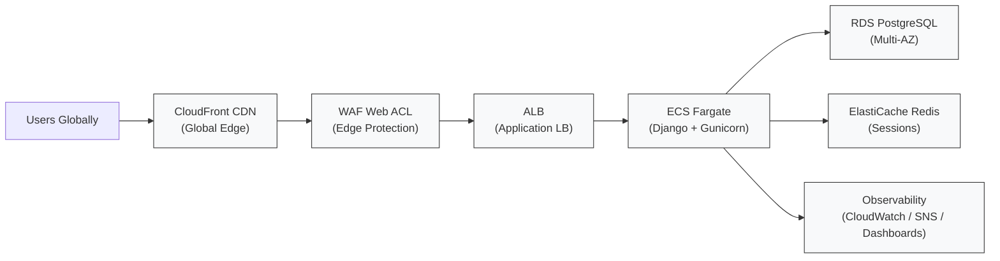
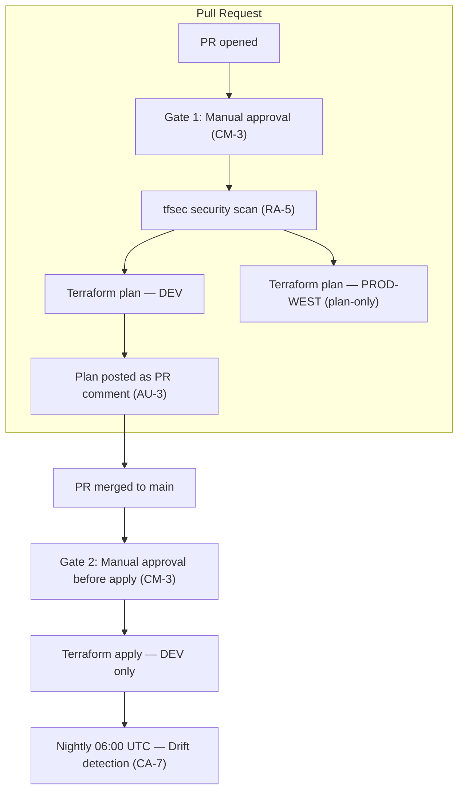

# Notesy Infrastructure


Production-grade AWS infrastructure for a Django application demonstrating NIST 800-53 aligned CI/CD pipelines, multi-region high availability, four golden signals observability, and zero-downtime deployments. Built as a portfolio project by a cloud infrastructure engineer.

## Architecture

## Architecture



### Multi-Region HA

Route 53 health checks route traffic to the PRIMARY region (us-east-1) by default.
- PRIMARY: us-east-1 (dev) — full stack active (ECS tasks, ALB, RDS Multi-AZ)
- STANDBY: us-west-2 (prod-west) — plan-only standby; lighter footprint, RDS read replica; activates on failover

## Module Structure

| Module | Purpose |
|--------|---------|
| networking | VPC, subnets, NAT Gateway, routing, IGW |
| alb | Application Load Balancer, target groups, listeners |
| ecs | ECS cluster, task definition, service, IAM roles |
| waf | WAF Web ACL, managed rule groups (OWASP, bad inputs) |
| cdn | CloudFront distribution, origin config, cache behaviors |
| rds | RDS PostgreSQL Multi-AZ, Secrets Manager integration |
| redis | ElastiCache Redis, session management |
| autoscaling | ECS target tracking, min 1 / max 10 tasks |
| monitoring | CloudWatch dashboard, alarms, SNS notifications |

## Environments

| Environment | Region | Purpose | Apply | Notes |
|-------------|--------|---------|-------|-------|
| dev | us-east-1 | Full stack development | Yes — via pipeline | Primary active environment |
| staging | us-east-1 | Demo only | Never applied | Shows multi-env governance |
| prod-west | us-west-2 | Standby HA region | Plan only | Activates on us-east-1 failure |

## NIST 800-53 Controls

| Control | Name | Implementation |
|---------|------|----------------|
| CM-3 | Configuration Change Control | Two manual approval gates before plan and apply |
| AC-6 | Least Privilege | OIDC federation — no stored AWS credentials anywhere |
| AU-2 | Audit Events | Full GitHub Actions pipeline logging with timestamps |
| AU-3 | Audit Record Content | Terraform plan posted as PR comment before every apply |
| RA-5 | Vulnerability Scanning | tfsec scans Terraform code before plan runs |
| CA-7 | Continuous Monitoring | Nightly drift detection via scheduled cron (6am UTC) |
| CM-6 | Configuration Settings | Drift detection baseline — alerts on manual changes |
| SC-28 | Protection at Rest | KMS encryption on RDS storage and S3 state bucket |

## Four Golden Signals — CloudWatch Observability

| Signal | Metric | Alarm Threshold | Evaluation Periods | Rationale |
|--------|--------|-----------------|-------------------|-----------|
| Latency | ALB TargetResponseTime | > 2 seconds | 2 periods | Avoids false positives during deployments |
| Traffic | ALB RequestCount | No alarm | — | Visibility only — used for correlation |
| Errors | ALB HTTPCode_Target_5XX | > 10 in 5 min | 3 periods | Sustained errors vs transient spikes |
| Saturation | ECS CPUUtilization | > 80% for 10 min | 2 periods | Auto scaling triggers at 70% — 80% means scaling gap |

Additional alarms:

- ECS MemoryUtilization > 80%
- RDS CPUUtilization > 70%
- ALB HealthyHostCount < 1 (fires immediately — always critical)


## Pipeline Flow



Notes:
- Drift detection uses `terraform plan -detailed-exitcode` (exit code 2 indicates drift and fails the job).
- Applies only run after two human approvals and only for the `dev` environment to preserve safety.

## Key Features

- Zero stored AWS credentials — OIDC federation only
- Terraform plan reviewed by humans before every apply
- Two manual approval gates per deployment (CM-3)
- Nightly drift detection — catches unauthorized console changes (CA-7)
- Multi-region standby architecture — prod-west (us-west-2)
- Four golden signals CloudWatch dashboard with tuned alarms
- Auto scaling: min 1 task, max 10 tasks, triggers at 70% CPU
- Zero downtime deployments: `minimum_healthy_percent = 100`
- RDS Multi-AZ with automated backups and point-in-time recovery
- All secrets in AWS Secrets Manager — never in code
- WAF managed rule groups at CloudFront edge

## Quick start

Prerequisites

- AWS CLI configured with correct account and region
- Terraform 1.15.5
- Git and a GitHub account

Local quickstart

```bash
# Clone
git clone https://github.com/gasper-anjanoh-dev/notesy-infrastructure.git
cd notesy-infrastructure

# Switch to environment
cd environments/dev
terraform init
terraform plan
terraform apply
```

Destroy

```bash
cd environments/dev
terraform destroy
```

## Cost

| Service | Daily Cost |
|---------|-----------:|
| NAT Gateway | ~$1.00 |
| ALB | ~$0.60 |
| RDS db.t3.micro | ~$0.80 |
| ElastiCache cache.t3.micro | ~$0.50 |
| ECS Fargate (1 task) | ~$0.05/hr |
| **Total** | **~$2.70/day** |

Tip: destroy when not in use. Redeploy takes approximately 15 minutes.

## Rollback Strategy

| Layer | Method | Time to Recover |
|-------|--------|-----------------|
| Application | Update ECS service to previous task definition revision | ~3 minutes |
| Docker image | Force new deployment with previous git SHA tag | ~3 minutes |
| Infrastructure | Revert Terraform commit, push to main, pipeline restores | ~15 minutes |
| Database | RDS point-in-time restore to any point in last 7 days | ~20 minutes |

## Portfolio note

This project was built to demonstrate production-grade infrastructure engineering patterns including NIST 800-53 compliance, GitOps workflows, multi-region high availability, and AWS best practices. The repository has been cloned by 75+ unique engineers in its first two weeks as a public repository, with particular interest in the NIST-aligned pipeline and plan-as-PR-comment pattern.

## Links

- notesy-app: https://github.com/gasper-anjanoh-dev/notesy-app
- Author GitHub: https://github.com/gasper-anjanoh-dev
- Author LinkedIn: https://www.linkedin.com/in/gasper-anjanoh-34320147/

## License

MIT License


